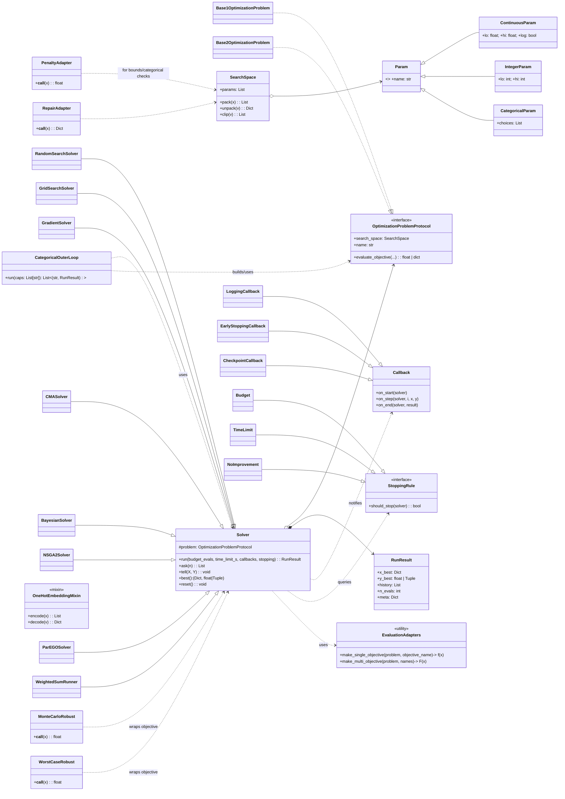

```mermaid
classDiagram
direction LR

%% ========= Problems =========
class OptimizationProblemProtocol {
  <<interface>>
  +evaluate_objective(...): float | dict
  +search_space: SearchSpace
  +name: str
}

class Base1OptimizationProblem
class Base2OptimizationProblem

Base1OptimizationProblem ..|> OptimizationProblemProtocol
Base2OptimizationProblem ..|> OptimizationProblemProtocol

%% ========= Search space =========
class SearchSpace {
  +params: List<Param>
  +pack(x): List<float>
  +unpack(v): Dict
  +clip(v): List<float>
}
class Param {<<abstract>> +name: str}
class ContinuousParam {+lo: float; +hi: float; +log: bool}
class IntegerParam {+lo: int; +hi: int}
class CategoricalParam {+choices: List<any>}

Param <|-- ContinuousParam
Param <|-- IntegerParam
Param <|-- CategoricalParam
SearchSpace o--> Param

%% ========= Core solver API =========
class Solver {
  #problem: OptimizationProblemProtocol
  +run(budget_evals, time_limit_s, callbacks, stopping): RunResult
  +ask(n): List<Dict>
  +tell(X, Y): void
  +best(): (Dict, float|Tuple)
  +reset(): void
}

class RunResult {
  +x_best: Dict
  +y_best: float | Tuple
  +history: List<Dict>
  +n_evals: int
  +meta: Dict
}

Solver o--> OptimizationProblemProtocol
Solver *--> RunResult

%% ========= Single-objective solvers (stubs) =========
class RandomSearchSolver
class GridSearchSolver
class GradientSolver
class CMASolver
class BayesianSolver

RandomSearchSolver --|> Solver
GridSearchSolver --|> Solver
GradientSolver --|> Solver
CMASolver --|> Solver
BayesianSolver --|> Solver

%% ========= Multi-objective solvers (stubs) =========
class NSGA2Solver
class ParEGOSolver
class WeightedSumRunner

NSGA2Solver --|> Solver
ParEGOSolver --|> Solver
WeightedSumRunner --|> Solver

%% ========= Mixed discrete orchestration =========
class CategoricalOuterLoop {
  +run(caps: List[str]): List<(str, RunResult)>
}
CategoricalOuterLoop ..> Solver : uses
CategoricalOuterLoop ..> OptimizationProblemProtocol : builds/uses

class OneHotEmbeddingMixin {
  <<mixin>>
  +encode(x): List<float>
  +decode(v): Dict
}

%% ========= Constraints & Robustness adapters =========
class PenaltyAdapter {
  +__call__(x): float
}
class RepairAdapter {
  +__call__(x): Dict
}

PenaltyAdapter ..> SearchSpace : for bounds/categorical checks
RepairAdapter ..> SearchSpace

class MonteCarloRobust {
  +__call__(x): float
}
class WorstCaseRobust {
  +__call__(x): float
}

MonteCarloRobust ..> Solver : wraps objective
WorstCaseRobust ..> Solver : wraps objective

%% ========= Callbacks & stopping =========
class Callback {
  +on_start(solver)
  +on_step(solver, i, x, y)
  +on_end(solver, result)
}
class LoggingCallback
class EarlyStoppingCallback
class CheckpointCallback

LoggingCallback --|> Callback
EarlyStoppingCallback --|> Callback
CheckpointCallback --|> Callback
Solver ..> Callback : notifies

class StoppingRule {
  <<interface>>
  +should_stop(solver): bool
}
class Budget
class TimeLimit
class NoImprovement

Budget --|> StoppingRule
TimeLimit --|> StoppingRule
NoImprovement --|> StoppingRule
Solver ..> StoppingRule : queries

%% ========= Evaluation adapters (functions) =========
class EvaluationAdapters {
  <<utility>>
  +make_single_objective(problem, objective_name)-> f(x)
  +make_multi_objective(problem, names)-> F(x)
}
Solver ..> EvaluationAdapters : uses
```